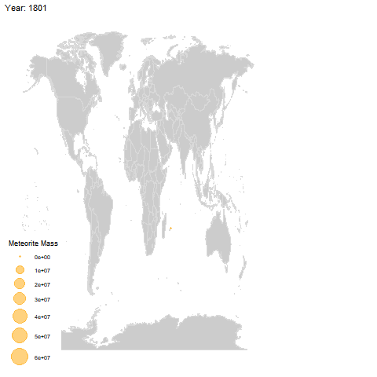

### Importing the data from R4DS Github page
```{r}
meteorites <- readr::read_csv("https://raw.githubusercontent.com/rfordatascience/tidytuesday/master/data/2019/2019-06-11/meteorites.csv")
```

### Import usual libraries

```{r}
library(tidyverse)
library(gganimate)
library(maps)
library(ggthemes)
  
```

### Look and explore the data


```{r}

str(meteorites)

```

### Initial thoughts

I've decided to document my thought process a bit more during these things.  I've looked at the data and immediately I can see a few things I'd like to investigate further:

1. Mapping the meteorites - so last week I did a bit of this, but I had to go and manually retrieve the Lat & Long data.  This mean that I had to manually input these into the table so it took some time, hence why I did the top 5 countries for [Ramen](https://emmamclarnon.github.io/tidy_tuesday/ramen_tidy.html).  But this week we are given the lat & long data, so this wil be better to map out the data.  I'm thinking I will put some sort of solar image at the pin just for fun (nerd alert!).  

2. I can see some dates, so some sort of timeline vs mass may be interesting to look at.

3. Correlation between location and mass may also be interesting to look at.  

4. Not sure what class relates to, but this may also realte to the mass.

Lot of things to look into and consider this week.  Last week was my first attempt and I totally ran out of time. I'm going to try and do more this week.


### 1. Plot with gganimate

Having looked into the data bit more, I think some sort of animation which plots the meteorites at their geographic locations, over time.

```{r}
#Filter out the years before 1800
meteorites_fil=meteorites%>%
  filter(year>=1800 & year <=2099)

```

```{r, eval=FALSE }
world <- ggplot() +
  borders("world", colour = "gray85", fill ="grey80") +
  theme_map( )

map <- world +
  geom_point(data=meteorites_fil, aes(x = long, y = lat, size = mass),
              
             colour = 'orange', alpha = .5) +
  scale_size_continuous(range = c(1, 10)
                        ) +labs(size = 'Meteorite Mass')+
  labs(title = 'Year: {frame_time}')+
   transition_time(year)+
  ease_aes('linear')

ani=animate(map)
anim_save("meteorites.gif", ani)

```



### 2. Mass vs. year recorded

Let's look into the year the meteorite was reported vs the mass to see if they are getting heavier over time.

```{r}

ggplot(meteorites_fil,aes(year,mass))+
  geom_line()

```


### 3. Location vs mass

I think the map shows some interesting patterns in the data: the locations aren't random by the looks of things.  Very few seem to have been found in Russia and South America.  This may be due to ease of finding them.

```{r}
world <- ggplot() +
  borders("world", colour = "gray85", fill ="grey80") +
  theme_map( )

map <- world +
  geom_point(data=meteorites_fil, aes(x = long, y = lat, size = mass),
              
             colour = 'orange', alpha = .5) +
  scale_size_continuous(range = c(1, 10)
                        ) +labs(size = 'Meteorite Mass')

map

```